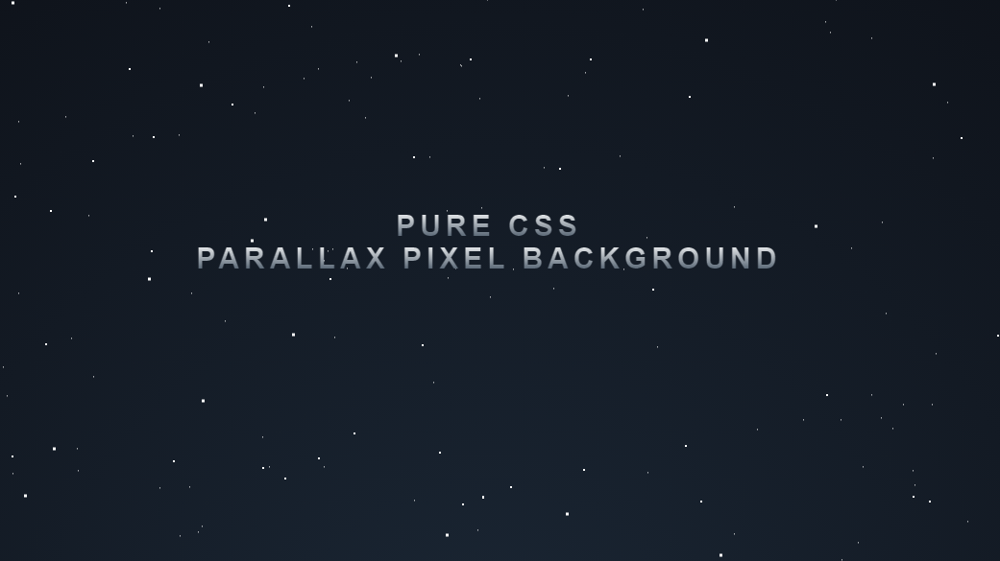

#  **Stars Parallax Background**

## 	&#127919; **About**
Um fundo com efeito parallax de céu noturno estrelado, sem o uso de imagens e com estrelas feitas em CSS, perfeito para uma seção principal em um site focado em espaço.

<a href="https://www.youtube.com/watch?v=aywzn9cf-_U&ab_channel=WebDevSHORTS"> 

**LINK DO TUTORIAL** 

</a>

## 🔧 **Techs** 🔧

HTML 
CSS 

### Caso queira visualizar este projeto, faça download desses arquivos e abra o index.html com o seu navegador/live server

## <a href="https://codepen.io/thiagofang/pen/jOxepNP">PROJETO NO CODE PEN</a>