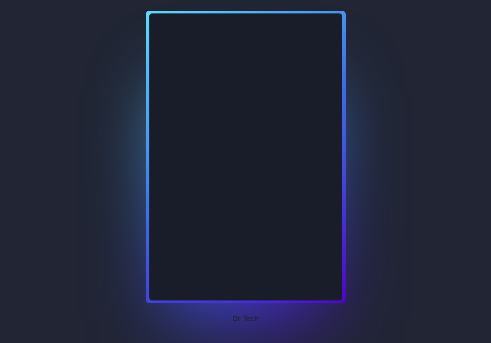

#  **Alexa Led - Magic Card**

## 	&#127919; **About**
Achei esse tutorial para fazer um cartão mágico que na hora percebi que lembra muito o Led que temos no echo dot, como achei muito bonito, resolvi fazer e trazer pra ca, mudei alguns detalhes como adicionar váriaveis de CSS para controlar melhor as cores, e também usar **Javascript** para trocar as cores de 5 em 5 segundos e adicionar um certo dinamismo ao projéto.

<a href="https://www.youtube.com/watch?v=6A6EE2lL3DM"> 
g
**LINK DO TUTORIAL** 

</a>

## 🔧 **Techs** 🔧

HTML 
CSS 
JavaScript 

### Caso queira visualizar este projeto, faça download desses arquivos e abra o index.html com o seu navegador/live server

### Em breve este projeto vai estar disponível no Code Pen