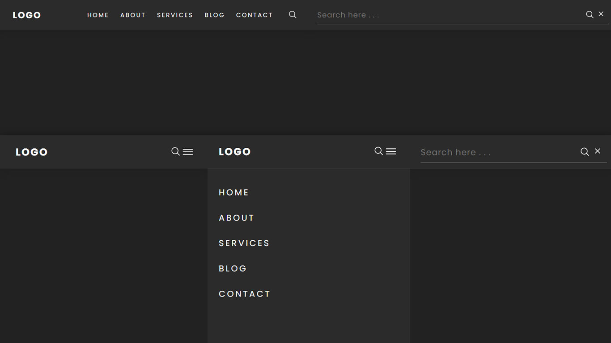

#  **Responsive Navigation Menu**

## 	&#127919; **About**
Projeto de menu responsivo com barra de pesquisa dinâmica dentro do próprio menu, ótimo para menu simple ou base para um menu mais personalizado.

<a href="https://www.youtube.com/watch?v=zQngLMkngQE&ab_channel=OnlineTutorials> 

**LINK DO TUTORIAL** 

</a>

## 🔧 **Techs** 🔧

HTML 
CSS 
JAVASCRIPT 

### Caso queira visualizar este projeto, faça download desses arquivos e abra o index.html com o seu navegador/live server

## <a href="https://codepen.io/thiagofang/pen/eYrjKdd">PROJETO NO CODE PEN</a>