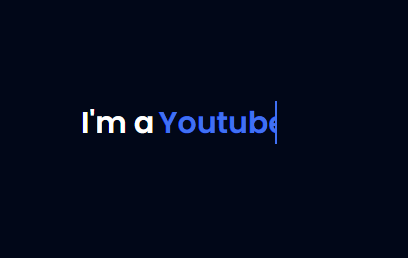

#  **Multiple Typing Animation**

## 	&#127919; **About**
Uma animação para textos simulando a escrita da palavra via teclado  
Essa animação alem de simples de se fazer, tem um charme incrivel quando relacionada a Tecnologia. 
Nessa animação usamos uma função do CSS chamada Steps, caso queira saber mais sobre o Steps: <a href="https://developer.mozilla.org/en-US/docs/Web/CSS/animation-timing-function" target="_blank">**clique aqui**</a>

<a href="https://www.youtube.com/watch?v=nxoHR9lltK0"> 

**LINK DO TUTORIAL** 

</a>

## 🔧 **Techs** 🔧

HTML 
CSS 
JavScript 

### Caso queira visualizar este projeto, faça download desses arquivos e abra o index.html com o seu navegador/live server

## <a href="https://codepen.io/thiagofang/pen/qBooROL">PROJETO NO CODE PEN</a>