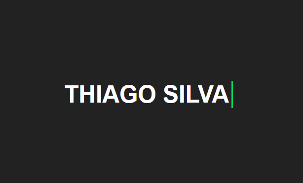

#  **Input Text Animation**

## 	&#127919; **About**
Esse efeito de texto escrito funciona muito bem para casos em que temos um fundo com várias cores ou até uma imagem

<a href="#"> 

**ESSE PROJETO AINDA NÃO TEM TUTORIAL** 

</a>

## 🔧 **Techs** 🔧

HTML 
CSS 
JAVASCRIPT

### Caso queira visualizar este projeto, faça download desses arquivos e abra o index.html com o seu navegador/live server

## <a href="https://codepen.io/thiagofang/pen/RwMBzpB">PROJETO NO CODE PEN</a>