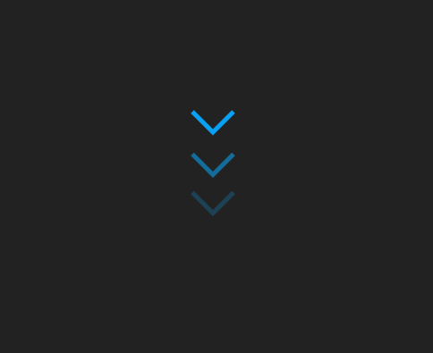

#  **Animated Arrow Down**

## 	&#127919; **About**
Uma seta animada apontando para baixo(pode ser usado como botão de scroll down) 
Esse provavelmente deve ser um dos mais procurados pelos devs iniciantes, principalmente para inclusão em páginas iniciais de portfolios/produtos.

<a href="https://www.youtube.com/watch?v=Kks5qdW9EcE&t=194s"> 

**LINK DO TUTORIAL** 

</a>

## 🔧 **Techs** 🔧

HTML 
CSS 

### Caso queira visualizar este projeto, faça download desses arquivos e abra o index.html com o seu navegador/live server

## <a href="https://codepen.io/thiagofang/pen/wvmyXxK">PROJETO NO CODE PEN</a>