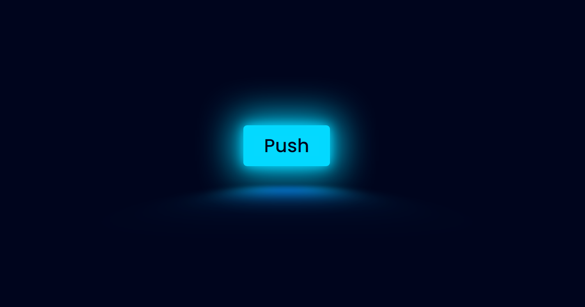

#  **Neon Button**

## 	&#127919; **About**
Um botão que simula bem os aspéctos de Neon, usando o mínimo de DIVs possiveis e focando no uso de ::before e ::after.

<a href="https://www.youtube.com/watch?v=JnOLPzhvgiI"> 

**LINK DO TUTORIAL** 

</a>

## 🔧 **Techs** 🔧

HTML 
CSS 

### Caso queira visualizar este projeto, faça download desses arquivos e abra o index.html com o seu navegador/live server

## <a href="https://codepen.io/thiagofang/pen/GRxQQbg ">PROJETO NO CODE PEN</a>