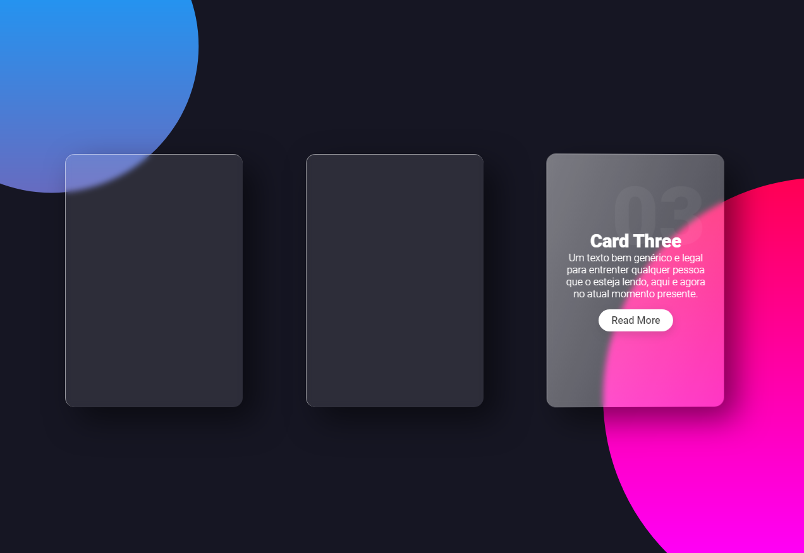

#  **Glassmorphism Card Effect**

## 	&#127919; **About**
Sou extremamente apaixonado por esse efeito de vidro em páginas web, porem nunca achei umam maneira efetiva de aplicar, com esse tutorial consegui entendi bem como usar esse efeito, e ja tenho várias ideias de como aplicar isso!

<a href="https://www.youtube.com/watch?v=hv0rNxr1XXk"> 

**LINK DO TUTORIAL** 

</a>

## 🔧 **Techs** 🔧

HTML 
CSS 
JavaScript 

### Caso queira visualizar este projeto, faça download desses arquivos e abra o index.html com o seu navegador/live server

### Em breve este projeto vai estar disponível no Code Pen 