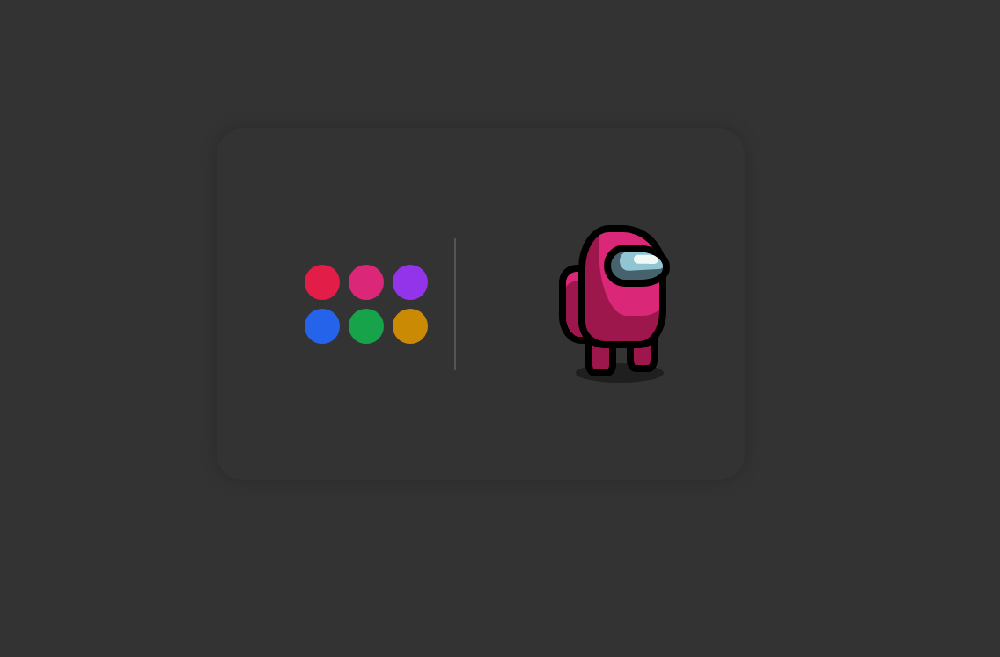

#  **Among Us Character draw**

## 	&#127919; **About**
Sempre achei incríveis os devs que conseguem desenhar com **HTML** e **CSS**, resolvi começar minha jornada com esse projéto que achei no canal do <a href="https://www.youtube.com/channel/UCnn6QwXCmb5kR5rqSQZAo2w">Heroway Brasil</a>. 
A parte em JavaScript fiz por minha conta, para poder dar uma interação a mais com o personagem, e também conseguir ver ele com várias cores diferentes

<a href="https://www.youtube.com/watch?v=YtMlEr7Phd0"> 

**LINK DO TUTORIAL** 

</a>

## 🔧 **Techs** 🔧

HTML 
CSS 
JavaScript 

### Caso queira visualizar este projeto, faça download desses arquivos e abra o index.html com o seu navegador/live server

### Em breve este projeto vai estar disponível no Code Pen