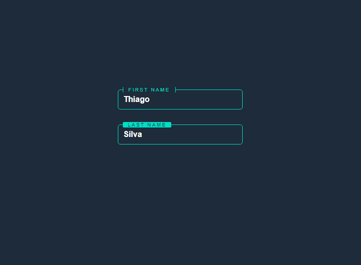

#  **Input Text Animation**

## 	&#127919; **About**
Esse projéto me deixou super curioso sobre como podiamos cortar uma parte da borda de um input usando CSS, e minha mente explodiu com a técnica de cortar a borda usando um objeto com a mesma cor do background geral.

<a href="https://www.youtube.com/watch?v=BMphVl9suxA"> 

**LINK DO TUTORIAL** 

</a>

## 🔧 **Techs** 🔧

HTML 
CSS 

### Caso queira visualizar este projeto, faça download desses arquivos e abra o index.html com o seu navegador/live server

## <a href="https://codepen.io/thiagofang/pen/WNzMePp">PROJETO NO CODE PEN</a>